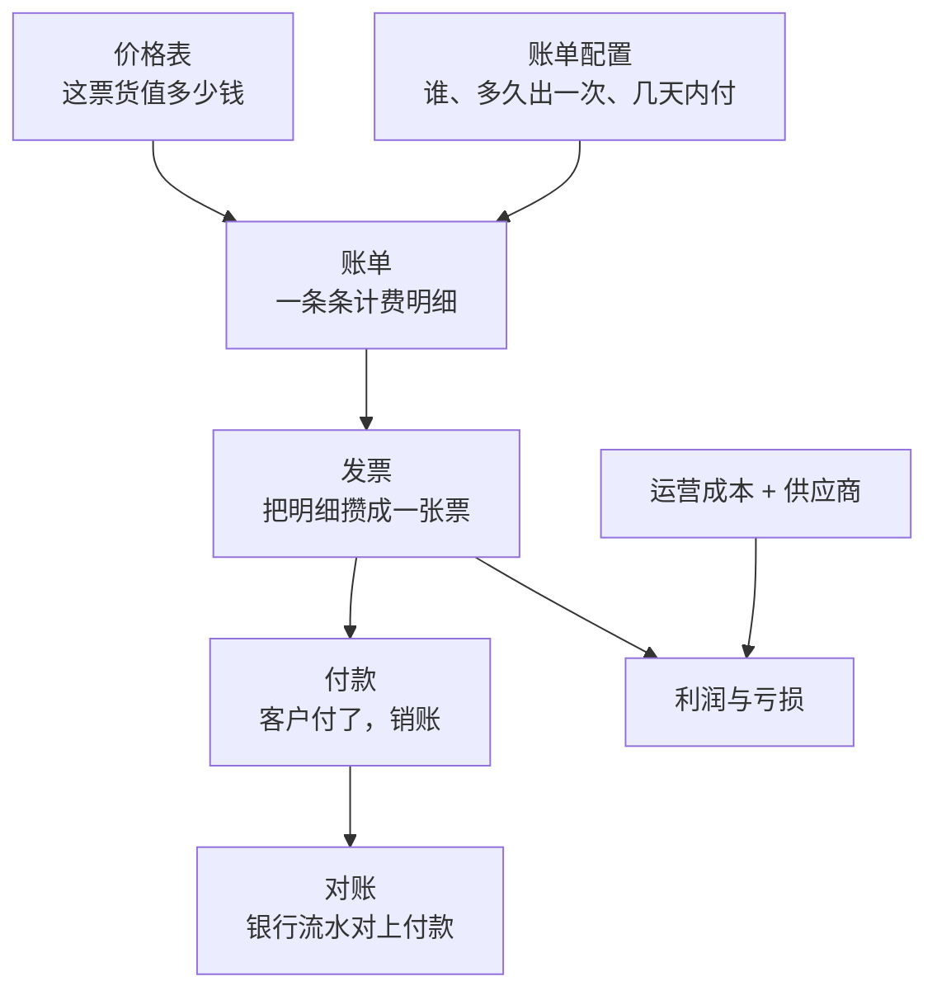

# 钱是怎么走的

账单菜单下面有十来个页面，第一次看容易懵。其实它们串在一条线上：

一句话版本：**价格表**决定单价，**账单**记下每票货该收多少，**发票**把账单攒成一张票
开给客户，客户**付款**，**对账**确认钱到账了。成本单独记，和收入一起算**利润**。

## 各页面干什么

| 菜单 | 一句话 |
|---|---|
| [价格表](./rate-cards) | 定价规则 |
| [账单配置](./billing-profiles) | 某个客户按什么周期、什么账期结算 |
| [账单](./billings) | 一条条计费明细，可勾选生成发票 |
| [发票](./invoices) | 开给客户的票，可发邮件、记录收款 |
| [付款](./payments) | 收款记录和银行水单核验 |
| [计费周期](./cycle-runs) | 自动出账的历史记录 |
| [对账](./reconciliation) | 银行流水和付款记录配对 |
| [运营成本与供应商](./costs) | 油费、工资、供应商报价 |
| [报告与利润](./reports) | 收入、成本、利润的汇总和导出 |

## 权限

整个 **账单** 菜单受权限控制——没有账单权限的人，**菜单条上根本不会出现它**。

菜单里面还有更细的权限：改价格表、记录收款、手工调整钱包余额，各自单独授权。
见[界面导航](../getting-started/navigation)。

## 多币种

系统支持多种币种。利润页面会提示当前显示的是哪一种币种的汇总。
