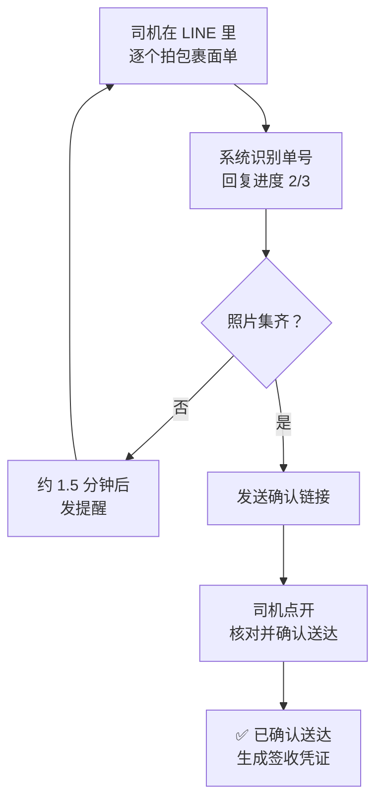

# 送达确认（POD）

送达确认全程在 **LINE** 里完成，司机不用登录后台。

司机把包裹面单一张张拍给 LINE，系统自动认出单号、匹配到运单；一票货的包裹照片
集齐之后，回一条**确认链接**；司机点链接确认，系统生成「已送达」事件，并把这些照片
存成**签收凭证**。

## 管理员：邀请司机

1. 进入 **合作伙伴 → 司机**，点右上角 **邀请司机**。
2. 系统生成一条注册链接并自动复制，通过 LINE 发给司机。

注意：

- 链接**约 2 天内有效**，过期重新生成。
- 提示「该组织尚未配置 API 密钥」，先到机构设置里生成 API 凭证。
- 需要平台侧已配置好 LINE 登录渠道，否则司机打开链接登录不了。

### 司机还没注册就先发了照片

会话里会出现一条**内部备注**，里面带一个链接。客服点开会跳到司机页面并自动填好这位
司机的 LINE 标识，补上姓名和电话保存即可。

## 司机：注册

1. 打开管理员发来的注册链接。
2. 点 **使用 LINE 登录**，在 LINE 授权页点同意。
3. 回到页面填**姓名**和**电话**，点 **注册**。

- 一个 LINE 账号只能绑定一家公司。
- 已注册过的司机再提交，只更新姓名和电话，不会重复建。

## 司机：确认送达

1. 在 LINE 里**逐个拍摄包裹面单**发到聊天窗口。面单要清晰、完整、光线充足，
   单号不要被遮挡或反光。
2. 系统识别后回复进度，比如「已收到 2/3 张包裹照片」。
3. 还有没拍的，停一会儿（约 1.5 分钟）会收到提醒。
4. 全部集齐后系统发**确认链接**。点开后：
   - 核对页面上的运单号和照片；
   - 需要的话调整**送达时间**（默认当前时间）；
   - 点 **确认送达**。
5. 聊天里收到「✅ 已确认送达」就完成了。

:::note
只打开链接不会误确认——**必须点页面上的按钮**才生效。
:::

## 常见问题

| 现象 | 原因与处理 |
|---|---|
| 回复「无法识别包裹单号」 | 照片模糊或单号被遮挡，重拍一张清晰的 |
| 发了照片完全没有回复 | 这位司机还没注册，按上面的邀请流程处理 |
| 提醒消息反复出现 | 还有包裹没拍，补齐剩下的 |
| 注册页面提示链接失效 | 邀请链接约 2 天过期，请管理员重新生成 |
| 登录后填表提示要重新登录 | LINE 登录状态只保留 10 分钟，重新点「使用 LINE 登录」 |
| 确认链接打不开 | 确认链接有效期 7 天，过期后重新发一遍包裹照片生成新链接 |
| 提示「已被其他组织注册」 | 一个 LINE 账号只能绑定一家公司，联系管理员 |

## 和扫码是两回事

| | [司机扫码](./scan) | 送达确认 |
|---|---|---|
| 在哪 | 手机浏览器 | LINE |
| 要登录吗 | 要 | 不要 |
| 干什么 | 记录各环节状态 | 拍照 + 确认送达 |
| 有照片吗 | 没有 | 有，存为签收凭证 |
