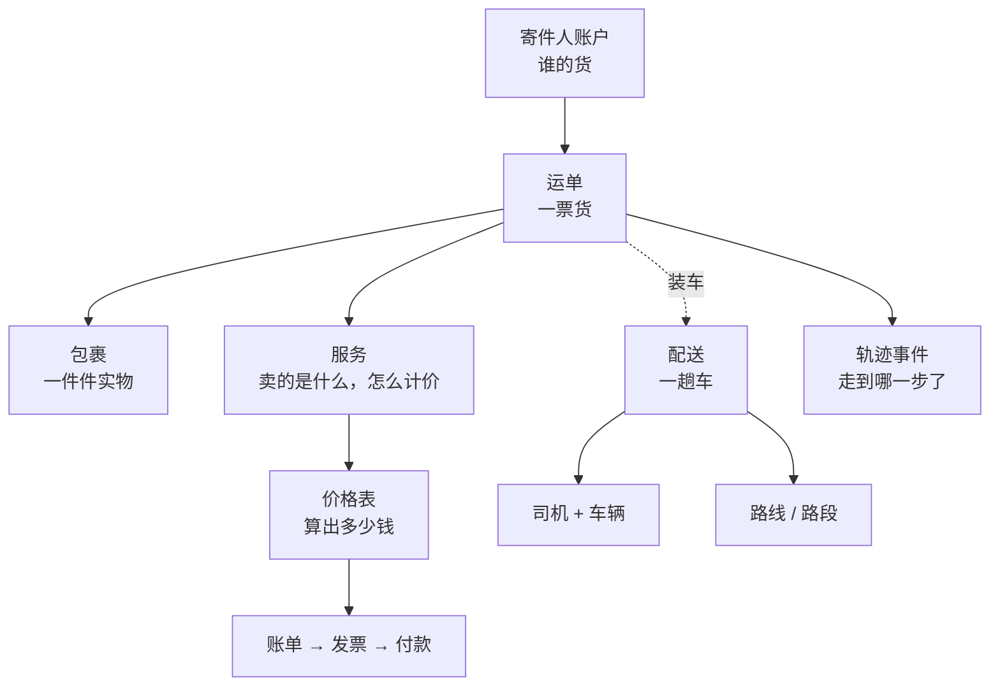

# 核心概念

十来个词，撑起整个系统。先把它们对上号，后面每一页都好读。

## 货怎么记

**运单**（Waybill）—— 一票货。从谁那儿发、发给谁、什么东西、多重多大，都记在运单上。
它是系统里所有事情的中心，运单号是你和客户对话时用的那个号。

**包裹**（Package）—— 运单下面一件件的实物。一票货可以只有一个包裹，也可以有几十个。
每个包裹有自己的号和标签，司机扫的是包裹。

> 一句话：客户问"我的货到哪了"问的是**运单**；司机手上拿的、扫的是**包裹**。

## 车怎么排

**配送**（Delivery）—— 一趟车。哪个司机、开哪辆车、今天拉哪些运单，记在配送上。
一趟配送通常装很多票运单。

**运单**和**配送**是两条并行的线，不要混：运单讲"货是什么"，配送讲"怎么拉走"。
同一票运单可能经过好几趟配送才到终点。

**路线**（Route）和**路段**（Legs）—— 货不是每次都一趟直达。跨区域时会分段走，
每一段叫一个路段，合起来是一条路线。

**站点**（Station）—— 车出发和归集的地方。排车时先选站点。

**服务区域**（Service Area）—— 地图上画出来的一块范围，用来决定哪些货归哪条线、
哪个区域派送。

## 钱怎么算

**服务**（Service）—— 你卖给客户的东西，以及它怎么计价。计价方式在服务上配置。

**价格表**（Rate Card）—— 一张价目表，算出这票货收多少钱。

:::note
界面上大部分地方叫**价格表**，个别页面里写作**费率卡**——是同一个东西。
:::

**账单**（Billing）→ **发票**（Invoice）→ **付款**（Payment）—— 钱的三步：先按价格表
产生账单明细，攒成发票开给客户，客户付款后销账。

**钱包**（Wallet）—— 寄件人账户上的预付余额，可以先充值后扣减。

## 人和机构

| 词 | 是谁 |
|---|---|
| **机构**（Organization） | 你所在的公司，数据的边界。你看到的一切都属于你的机构 |
| **团队成员**（Sub Accounts） | 机构里的同事账号，各自有不同权限 |
| **寄件人账户**（Sender Accounts） | 把货交给你发的客户，账单挂在它下面 |
| **客户**（Contractors） | 把运输业务交给你的上家 |
| **承运商**（Subcontractors） | 你把运输业务交出去的下家 |
| **司机**（Drivers） | 实际开车送货的人，用手机扫码页 |

**客户**和**承运商**方向是反的，容易看串：货从**客户**那儿来，交到**承运商**手上。

## 状态怎么变

**轨迹事件**（Tracking Event）—— 货每走一步，系统记一条事件：已接、分拣、在途、
配送中、已送达……这串事件就是客户在查件页看到的物流轨迹。

事件大多由司机扫码产生，也可以在运单上手工补录，或者由对接的第三方系统推送。
完整清单见[运单状态参考](../waybills/statuses)。
