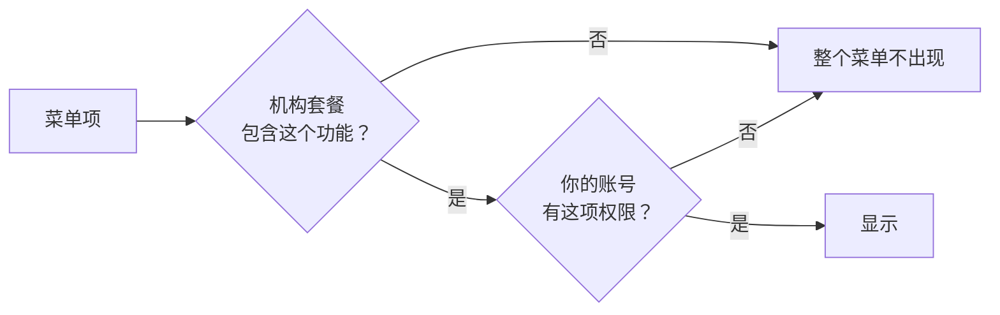

# 界面导航

登录后落在 **运单** 页——日常干活的默认起点。

顶部是一条横向菜单条：一个直达链接 **运单**，四个下拉菜单，最右边是你的头像。
手机上收成一个折叠菜单，层级一样。

## 菜单里有什么

| 菜单 | 下面是 |
|---|---|
| **运单** | 直接进运单列表，没有下拉 |
| **配送** | 规划 · 轨迹 · 地址预处理 |
| **合作伙伴** | 司机 · 承运商 · 客户 · 寄件人账户 |
| **账单** | 价格表 · 账单配置 · 账单 · 发票 · 付款 · 计费周期 · 报告 · 对账 · 运营成本 · 供应商 · 利润与亏损 |
| **设置** | 服务 · 服务区域 · 货物类别 · 路线 · 自动化 · 团队成员 · 标签模板 · 机构 · 集成 |

头像菜单里是 **账号信息**（改个人资料和密码）、语言切换和 **退出**。

## 为什么我看不到某个菜单

这是最常见的疑问。菜单是**双重门**，两道都过了才显示：

1. **套餐功能** —— 按机构算。没有购买的功能，整个机构都看不到，管理员也一样。
2. **账号权限** —— 按人算。同一个机构里，两个人看到的菜单可以完全不同。

所以"同事有我没有"通常是权限问题，"谁都没有"通常是套餐问题。前者找机构管理员在
**设置 → 团队成员** 里加；后者要联系我们开通。

**账单** 菜单尤其明显：没有账单权限的人，整个菜单条上根本不会出现它。

## 菜单里找不到、但确实存在的几个页面

有几个页面没有放进下拉菜单，只能从相关页面点进去：

| 页面 | 从哪进 |
|---|---|
| 收款银行账户 | **账单 → 付款** 页面内的入口 |
| 寄件人账户类型 | **合作伙伴 → 寄件人账户** 页面内的入口 |
| 自定义域名 | 设置里的跟踪页配置，从相关页面进入 |

另外，直接访问 `/app/settings` 会看到一个"即将推出"的占位页——真正的设置项都在
**设置** 下拉菜单里，不在那一页。

## 切换语言

头像菜单里可以切中文和英文。切换只影响界面，不改数据。

这份文档也有两种语言，右上角切换。文档里提到的菜单名，用的就是界面上的原词——
你用哪种语言看界面，就把文档切到哪种语言。
