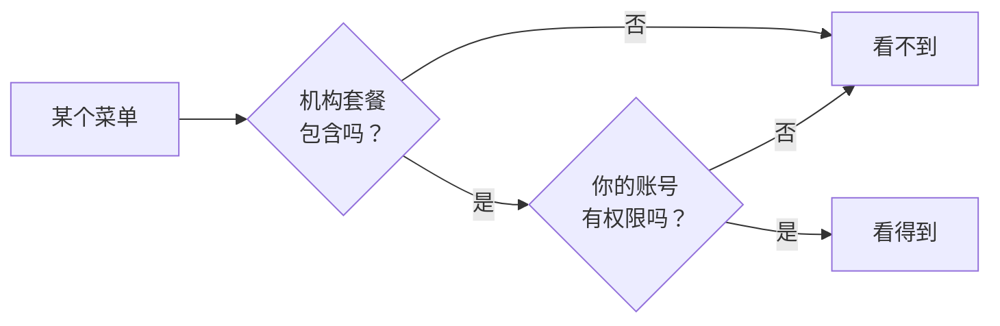

# 功能与套餐

"为什么我看不到这个菜单"——这一页专门回答它。

## 两道门

| | 套餐功能 | 账号权限 |
|---|---|---|
| 按什么算 | **按机构** | **按人** |
| 谁能改 | 联系我们开通 | 机构管理员在 **设置 → 团队成员** 里改 |
| 表现 | 机构里**所有人**都看不到 | **只有你**看不到，同事能看到 |

**先问同事看不看得到**——这一句就能分清是哪道门。

## 自查

| 情况 | 结论 |
|---|---|
| 同事看得到，我看不到 | 权限问题，找管理员 |
| 全机构都看不到 | 套餐问题，联系我们 |
| 以前能看，现在没了 | 权限被调整，或者套餐变更了 |

## 受套餐控制的功能

各机构套餐不同，大致覆盖这些方面：运单、配送规划与轨迹、地址预处理、司机、承运商、
客户、寄件人账户、账单与对账、运营成本、报告、服务区域、货物类别、路线、自动化、
团队成员、标签模板、自定义域名、客服、接口访问。

当前套餐包含哪些，在 **设置 → 机构 → 订阅** 里看，也可以在那里申请变更。

## 集成页面上的锁

**设置 → 集成** 里，套餐没包含的渠道会显示成**锁定**的卡片——能看到有这么个东西，
但配置不了。需要的话申请开通。
