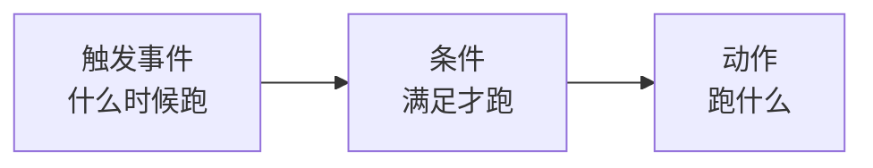

# 自动化规则

**设置 → 自动化** 让系统在某件事发生时自动做另一件事——最常见的用法是**把配送事件
推送到你自己的系统**。

## 一条规则的组成

### 触发

选什么事件触发这条规则。

### 条件

条件是可选的。不加条件时页面会明确写着"**无适用条件**——触发事件发生时将自动调用"。

加了条件的话，**所有条件都要满足**才执行。常用的筛法是：

- 按 **服务区域** —— 只有某几个片区的货才触发；
- 按 **事件类型** —— 只有某几种状态才触发。

### 动作

选 **动作类型**。一条规则可以配多个动作，按顺序编号。

最常用的动作是 **HTTP 回调（Webhook）**：事件发生时，系统把数据 POST 到你填的地址。

## 测试你的回调

编辑规则时可以**直接触发一次**看看对方收没收到。返回空响应体时页面会提示
"**响应体为空**"——这通常是正常的，说明对方收到了但没返回内容。

填的测试数据必须是 JSON 对象，否则提示"**负载必须是 JSON 对象**"。

## 启用和停用

规则可以随时**启用/停用**，切换后提示"自动化规则已启用/已停用"。不用的规则建议停用
而不是删除，改天还要用时不必重配。

## 技术细节

回调的数据格式、重试行为、以及从代码那边怎么接，见
[开发者指南的 Webhook 章节](/tms/webhooks)。

:::note
Webhook 只能在这个界面上配置，**没有订阅接口**。这是设计如此。
:::
