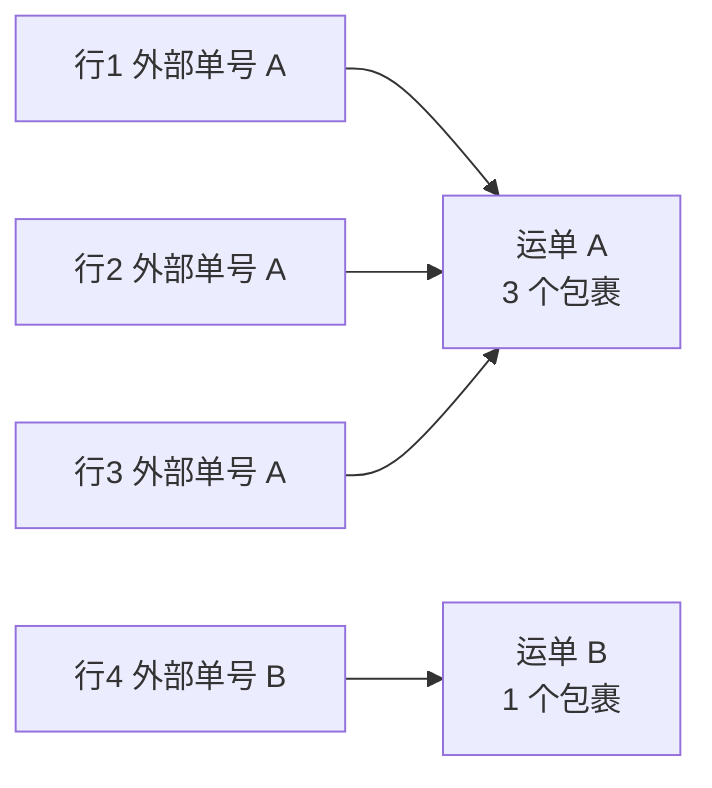

# 导入运单

批量建单靠这一个入口：运单列表右上角的 **导入**。

## 一行等于一个包裹

这是最容易搞错的地方，先记住：

> **CSV 里每一行是一个包裹，不是一票运单。**

多行怎么合成一票运单，按下面的规则：

- **外部运单号相同**的行，合成同一票运单（多个包裹）；
- **外部运单号留空**时，**寄件账户和收件人信息都相同**的行合成一票。

所以一票三件货，就写三行，外部运单号填同一个。

## 操作步骤

1. 在运单列表点 **导入**。
2. 点 **下载示例 CSV**，拿到带表头和示例行的模板。
3. 按模板填数据，然后：
   - **不要改动、重命名或调整表头行的顺序**；
   - **删掉模板里的说明行和示例行**再导入。
4. 回到弹窗选 **CSV 文件**。
5. 选 **服务**（必选）——这批运单卖的是哪个服务。
6. 选 **路线（可选）**。只有一条路线可选时系统会自动选上并标注"自动选择"。
7. 点确认导入。

## 填表规则

| 规则 | 说明 |
|---|---|
| 必填列 | 寄件账户代码、收件人姓名、电话、地址 |
| 选填列 | 用不上的留空即可，不要删列 |
| 单位 | 重量 **kg**，长宽高 **cm** |
| 数字 | 只填数字，不要带单位 |
| 国家 | 只接受支持的国家，填错会在校验时指出 |

## 校验和结果

点导入后系统先整表校验。有问题会列出**每一行的错误**，例如：

- 第 N 行：收件人姓名为必填
- 第 N 行：收件人地址为必填
- 第 N 行：寄件账户代码为必填
- 第 N 行：不支持的国家
- 第 N 行：未知的增值服务

**校验不过就不会导入**，改完表重新上传即可。

校验通过后开始处理，结束时给一份 **导入结果**：成功多少票（多少个包裹）、失败多少票。
两部分分开列，失败的那条会写明原因。

:::tip 大表先试小样
第一次用新模板，先切十几行试导一次。确认字段对得上，再传整张表。
:::
