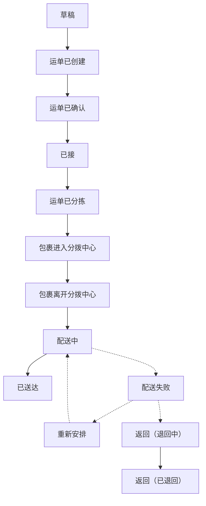

# 运单状态参考

货每走一步，系统记一条**轨迹事件**。这串事件就是客户在查件页看到的物流轨迹，也是
你在运单详情右侧看到的时间线。

## 正常流程

跨区域分段运输的货会在分拨中心之间来回几轮"进入/离开"，不是异常。

## 状态一览

| 状态 | 什么时候出现 |
|---|---|
| 草稿 | 运单还没装箱，待完善 |
| 运单已创建 | 运单建好了，还没确认。**这个状态打不了标签** |
| 运单已确认 | 承运方已接单 |
| 已接 | 货已取到手 |
| 运单已分拣 | 在分拨中心完成分拣 |
| 在运输中，包裹进入分拨中心 | 到达某个分拨中心 |
| 在运输中，包裹离开分拨中心 | 从分拨中心发出 |
| 运输中 | 在途 |
| 配送中 | 已经派给司机，正在送 |
| 已送达 | 送到了 |
| 配送失败 | 这一趟没送成 |
| 重新安排 | 改期再送 |
| 配送异常 | 出了需要人工处理的状况 |
| 返回 | 退回途中，或已退回 |
| 已取消 | 运单作废 |

:::note 两个"返回"是两件事
中文界面上**退回途中**和**已退回**显示的都是「返回」。看时间线时按前后顺序判断：
先出现的是还在退，后出现的是已经退到了。
:::

## 状态从哪来

| 来源 | 说明 |
|---|---|
| 司机扫码 | 主要来源，见[司机扫码](../driver/scan) |
| 手工补录 | 后台补一条，见[添加轨迹事件](./events) |
| 接口推送 | 对接的系统推进来，见[开发者指南](/tms/webhooks) |

## 状态变了想让自己的系统知道

配置一条**自动化规则**，在配送事件产生时回调你的地址。在 **设置 → 自动化** 里配，
技术细节见[开发者指南的 Webhook 章节](/tms/webhooks)。
