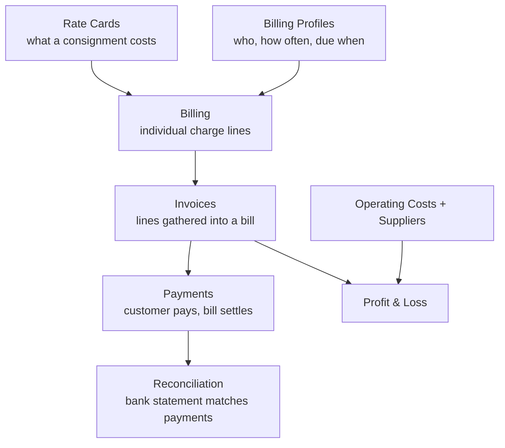

# How the money moves

The Billing menu has a dozen pages under it, which is bewildering at first. They're all
links in one chain:

The short version: **rate cards** set the price, **billing** records what each
consignment owes, **invoices** gather those lines into a bill, the customer **pays**, and
**reconciliation** confirms the money actually arrived. Costs are tracked separately and
combined with revenue to give **profit**.

## What each page is for

| Menu | In one line |
|---|---|
| [Rate Cards](./rate-cards) | Pricing rules |
| [Billing Profiles](./billing-profiles) | A customer's cycle and payment terms |
| [Billing](./billings) | Charge lines; select them to raise an invoice |
| [Invoices](./invoices) | The bill sent to the customer; email it, record payment |
| [Payments](./payments) | Receipts and bank slip verification |
| [Cycle Runs](./cycle-runs) | History of automatic invoicing runs |
| [Reconciliation](./reconciliation) | Matching bank credits to payments |
| [Operating costs and suppliers](./costs) | Fuel, wages, supplier quotes |
| [Reports and profit](./reports) | Revenue, cost and profit summaries and exports |

## Permissions

The whole **Billing** menu is permission-gated — without it, the menu **doesn't appear in
the bar at all**.

Inside it, finer permissions apply: changing rate cards, recording payments and adjusting
a wallet balance by hand are each granted separately. See
[Finding your way around](../getting-started/navigation).

## Multiple currencies

The system handles several currencies. The profit page states which currency the
summary is showing.
