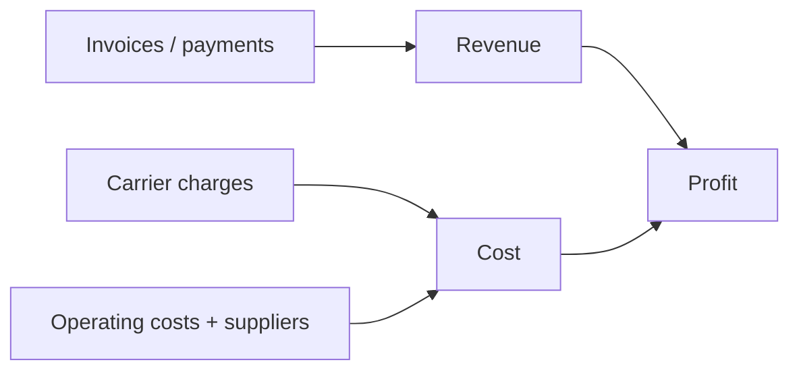

# Reports and profit

## Billing reports

**Billing → Reports** shows revenue and related analysis across tabs, filtered by
**date range** and **contractor**; revenue also takes a period.

**Export CSV** in the top right produces a file named with today's date. Use it when you
want to pivot the numbers yourself in a spreadsheet.

## Profit & Loss

**Billing → Profit & Loss** gives the whole picture on one page: **revenue minus carrier
costs and operating costs**.

Pick the span at the top: **This month**, **Last month**, **This quarter**,
**This year**.

The page states which **currency** the summary covers — if you work in several, check
that line first, because currencies are never totalled together.

## Where the numbers come from

So the profit figure is only as good as two habits:

1. invoices raised and payments recorded;
2. [operating costs](./costs) entered honestly.

Miss the costs and the profit is fiction.
