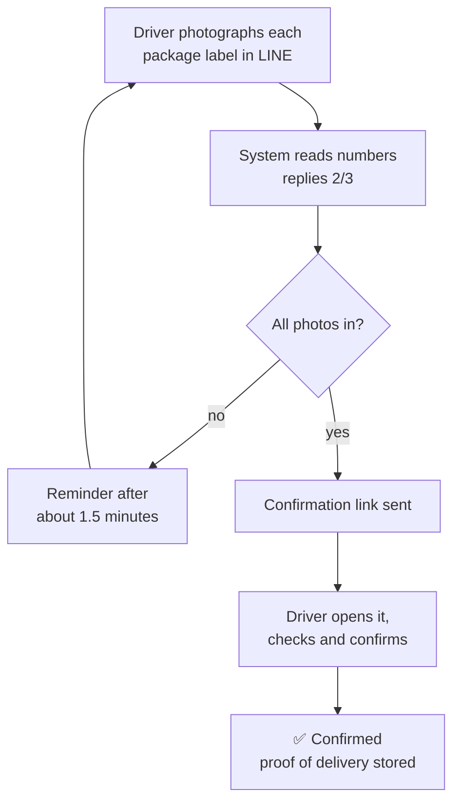

# Delivery confirmation (POD)

Delivery confirmation happens entirely in **LINE**. Drivers never sign into the back
office for it.

The driver photographs each package label and sends it to LINE. The system reads the
number, matches it to a waybill, and once every package on that waybill has a photo it
replies with a **confirmation link**. The driver taps it to confirm, which creates the
"Delivered" event and stores the photos as **proof of delivery**.

## Admin: inviting a driver

1. Go to **Partners → Drivers** and click **Invite Driver** in the top right.
2. A registration link is generated and copied automatically — send it over LINE.

Notes:

- The link is valid for **about 2 days**; regenerate it after that.
- If you're told the organization has no API credentials, generate them in the
  organization settings first.
- LINE login must be configured on the platform side, or the driver can't sign in.

### A driver sends photos before registering

An **internal note** appears in the conversation with a link in it. Support clicks it,
lands on the drivers page with that driver's LINE identity already filled in, and adds
the name and phone.

## Driver: registering

1. Open the registration link from your admin.
2. Tap **Sign in with LINE** and approve on the LINE authorization page.
3. Back on the page, enter your **name** and **phone**, then **Register**.

- One LINE account can only be bound to one company.
- A driver registering again only updates the name and phone; nothing is duplicated.

## Driver: confirming delivery

1. In LINE, **photograph each package label** and send them into the chat. Keep labels
   sharp, complete and well lit, with nothing covering or reflecting off the number.
2. The system replies with progress, e.g. "2 of 3 package photos received".
3. Stop partway and a reminder arrives after about 1.5 minutes.
4. Once all are in, the system sends a **confirmation link**. Open it and:
   - check the waybill number and photos shown;
   - adjust the **delivery time** if needed (it defaults to now);
   - tap **Confirm delivered**.
5. "✅ Delivery confirmed" in the chat means you're done.

:::note
Merely opening the link confirms nothing — **you have to tap the button**.
:::

## Troubleshooting

| Symptom | Cause and fix |
|---|---|
| "Could not recognize the package number" | Blurred or obscured photo — retake it clearly |
| No reply at all to photos | The driver isn't registered; follow the invitation steps above |
| The reminder keeps coming | Packages still missing; send the rest |
| Registration link expired | Invitations last about 2 days; ask for a new one |
| Asked to sign in again while filling the form | LINE sign-in lasts 10 minutes; tap **Sign in with LINE** again |
| Confirmation link won't open | Confirmation links last 7 days; resend the package photos for a fresh one |
| "Already registered with another organization" | One LINE account, one company. Contact your admin |

## Not the same as scanning

| | [Driver scanning](./scan) | Delivery confirmation |
|---|---|---|
| Where | Phone browser | LINE |
| Sign-in needed | Yes | No |
| What it does | Records status at each step | Photos plus delivery confirmation |
| Photos | No | Yes, stored as proof of delivery |
