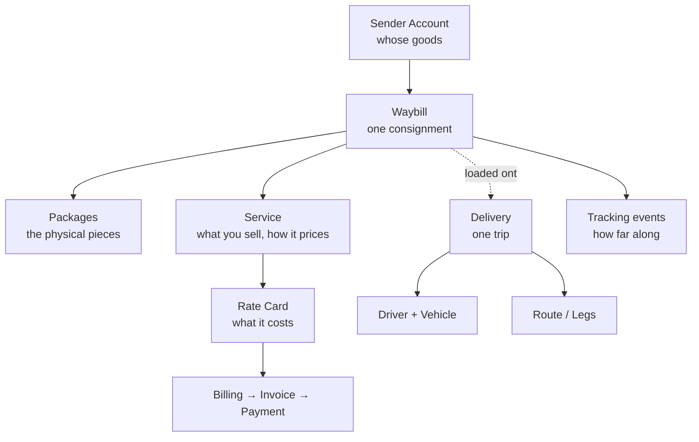

# Core concepts

A dozen words hold up the whole system. Get them straight and every other page reads
easily.

## Recording the goods

**Waybill** — one consignment. Who sent it, who receives it, what it is, how heavy and
how big. It is the centre of everything, and its waybill number is the one you quote to
customers.

**Package** — an individual physical piece under a waybill. A consignment might be one
package or forty. Each has its own number and label, and packages are what drivers scan.

> In short: a customer asking "where are my goods?" means the **waybill**; what the
> driver is holding and scanning is a **package**.

## Moving them

**Delivery** — one trip. Which driver, which vehicle, which waybills go today. One
delivery usually carries many waybills.

**Waybills** and **deliveries** are parallel threads, not the same thing: a waybill says
what the goods are, a delivery says how they travel. One waybill may ride several
deliveries before it arrives.

**Route** and **Legs** — goods don't always go direct. Across regions they move in
stages; each stage is a leg and together they form a route.

**Station** — where a trip starts and ends. Planning starts by picking one.

**Service Area** — a zone drawn on the map, used to decide which goods belong to which
run and which area delivers them.

## Working out the money

**Service** — what you sell to customers, and how it is priced. Pricing is configured on
the service.

**Rate Card** — the price table that works out what a consignment costs.

:::note
Most screens call it a **rate card**; one or two say **fee card**. Same thing.
:::

**Billing** → **Invoice** → **Payment** — three steps: the rate card produces billing
lines, lines are gathered into an invoice for the customer, and the customer's payment
settles it.

**Wallet** — a prepaid balance on a sender account: top up, then draw down.

## People and organizations

| Term | Who |
|---|---|
| **Organization** | Your company, and the boundary of your data. Everything you see belongs to it |
| **Sub Accounts** | Your colleagues' accounts, each with its own permissions |
| **Sender Accounts** | Customers who ship through you; billing hangs off these |
| **Contractors** | Upstream: the people who give you freight to move |
| **Subcontractors** | Downstream: the people you hand freight to |
| **Drivers** | The people actually driving, using the mobile scanner |

**Contractors** and **subcontractors** point in opposite directions: goods come *from* a
contractor and go *to* a subcontractor.

## How status changes

**Tracking event** — every step produces an event: picked up, sorted, in transit, out
for delivery, delivered. That chain is exactly what customers see on the tracking page.

Most events come from drivers scanning; they can also be added by hand on a waybill, or
pushed in by a connected system. The full list is in the
[waybill status reference](../waybills/statuses).
