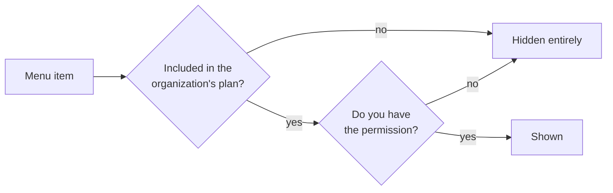

# Finding your way around

Signing in lands you on **Waybills** — the default starting point for daily work.

Across the top is a horizontal menu bar: one direct link, **Waybills**, then four
dropdowns, with your avatar on the far right. On a phone it collapses into one menu with
the same structure.

## What's in the menus

| Menu | Contains |
|---|---|
| **Waybills** | Goes straight to the waybill list — no dropdown |
| **Delivery** | Planning · Tracking · Address Preprocessing |
| **Partners** | Drivers · Subcontractors · Contractors · Sender Accounts |
| **Billing** | Rate Cards · Billing Profiles · Billing · Invoices · Payments · Cycle Runs · Reports · Reconciliation · Operating Costs · Suppliers · Profit & Loss |
| **Settings** | Services · Service Areas · Product Categories · Routes · Automation · Sub Accounts · Label Templates · Organization · Integrations |

The avatar menu holds **Profile** (your details and password), the language switch, and
**Logout**.

## Why can't I see a menu?

The most common question. Menus sit behind **two gates**, and both must open:

1. **Plan features** — per organization. Anything not purchased is hidden from the whole
   organization, admins included.
2. **Account permissions** — per person. Two people in the same organization can see
   completely different menus.

So "my colleague has it and I don't" is usually permissions, and "nobody has it" is
usually the plan. The first is fixed by your admin under **Settings → Sub Accounts**;
the second needs us to enable it.

**Billing** shows this most clearly: without the billing permission the menu doesn't
appear in the bar at all.

## Pages that exist but aren't in a menu

A few pages are only reachable from a link on another page:

| Page | Get there from |
|---|---|
| Receiving Bank Accounts | Inside **Billing → Payments** |
| Sender Account Types | Inside **Partners → Sender Accounts** |
| Custom Domain | From the tracking page configuration |

Also, going directly to `/app/settings` shows a "Coming Soon" placeholder — the real
settings all live in the **Settings** dropdown, not on that page.

## Switching language

The avatar menu switches between English and Chinese. It changes the interface only,
never your data.

This guide comes in the same two languages — switch in the top right. Menu names here
are the product's own words, so read the guide in whichever language you run the
interface.
