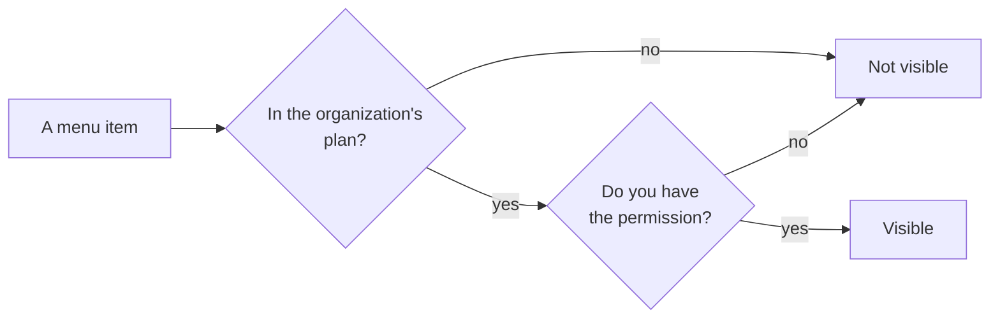

# Plans and features

"Why can't I see this menu?" — this page exists to answer it.

## Two gates

| | Plan features | Account permissions |
|---|---|---|
| Scope | **Per organization** | **Per person** |
| Who changes it | Contact us to enable | Your admin, under **Settings → Sub Accounts** |
| Symptom | **Nobody** in the organization sees it | **Only you** can't see it; colleagues can |

**Ask a colleague whether they can see it.** That one question tells you which gate it is.

## Working it out

| Situation | Conclusion |
|---|---|
| Colleagues see it, I don't | Permissions — ask your admin |
| Nobody sees it | Plan — contact us |
| It used to be there | Permissions were changed, or the plan did |

## What the plan controls

Plans differ, but they broadly cover: waybills, delivery planning and tracking, address
preprocessing, drivers, subcontractors, contractors, sender accounts, billing and
reconciliation, operating costs, reports, service areas, product categories, routes,
automation, sub accounts, label templates, custom domain, customer service, and API
access.

What yours includes is under **Settings → Organization → Subscription**, where you can
also request a change.

## The locks on the integrations page

Under **Settings → Integrations**, channels not in your plan appear as **locked** cards —
visible, but not configurable. Ask to have them enabled if you need one.
