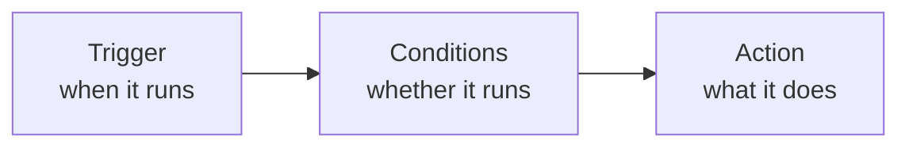

# Automation rules

**Settings → Automation** makes the system do something when something else happens. The
common use is **pushing delivery events into your own system**.

## What a rule is made of

### Trigger

The event that fires the rule.

### Conditions

Optional. With none, the page states plainly: "**No Condition is appliable** — this will
be called automatically when the trigger event occurs."

With conditions, **all of them must match**. The usual ones are:

- **Service Areas** — only goods in certain zones;
- **Event Types** — only certain statuses.

### Actions

Pick an **Action Type**. A rule can carry several actions, numbered in order.

The common one is an **HTTP webhook**: when the event fires, the system POSTs the data to
an address you supply.

## Testing your webhook

While editing a rule you can **fire it once** to see whether the other end receives it.
An empty response reports "**Empty response body**" — usually fine, meaning they received
it and returned nothing.

Test payloads must be JSON objects, or you get "**Payload must be a JSON object**".

## Enabling and disabling

Rules can be switched on and off at any time, confirmed with "Automation rule
enabled/disabled". Disable rules you aren't using rather than deleting them — you won't
have to rebuild them later.

## Technical detail

The payload format, retry behaviour and how to receive it in code are in the
[Developer Guide's webhook chapter](/tms/webhooks).

:::note
Webhooks are configured here and nowhere else — **there is no subscription API**. That's
by design.
:::
