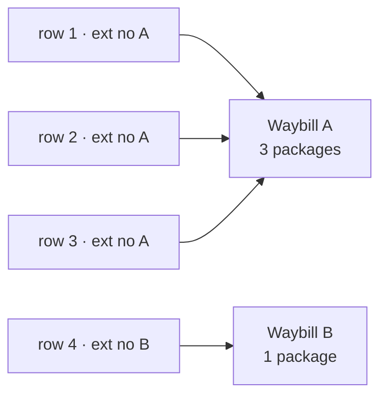

# Importing waybills

Bulk entry goes through one door: **Import**, at the top right of the waybill list.

## One row is one package

This is the part everyone gets wrong, so learn it first:

> **Each row in the CSV is a package, not a waybill.**

Rows are grouped into waybills like this:

- rows sharing the same **External Waybill No** become one waybill with several
  packages;
- when **External Waybill No is empty**, rows with the **same sender account and the
  same recipient** are grouped together.

So a consignment of three pieces is three rows carrying the same external waybill number.

## Steps

1. Click **Import** on the waybill list.
2. Click **Download Sample CSV** for a template with headers and example rows.
3. Fill in your data, and:
   - **do not edit, rename or reorder the header row**;
   - **delete the guidance and example rows** before importing.
4. Choose your **CSV File**.
5. Pick a **Service** (required) — what these waybills are sold as.
6. Pick a **Route (Optional)**. When only one route is available it is selected
   automatically and marked as such.
7. Confirm the import.

## Filling in the sheet

| Rule | Detail |
|---|---|
| Required columns | Sender account code, recipient name, phone, address |
| Optional columns | Leave unused ones empty — don't delete the column |
| Units | Weight in **kg**, length/width/height in **cm** |
| Numbers | Digits only, no units |
| Country | Only supported countries; a bad value is flagged in validation |

## Validation and results

The whole sheet is validated first. Problems are listed **per row**, for example:

- Row N: Recipient Name is required
- Row N: Recipient Address is required
- Row N: Sender Account Code is required
- Row N: Unsupported country
- Row N: Unknown add-on service

**Nothing is imported while validation fails.** Fix the sheet and upload again.

Once it passes, the import runs and produces **Import Results**: how many waybills (and
packages) succeeded, and how many failed. The two are listed separately, with a reason
against each failure.

:::tip Try a sample first
The first time you use a new template, import a dozen rows. Confirm the fields land
where you expect before sending the whole sheet.
:::
