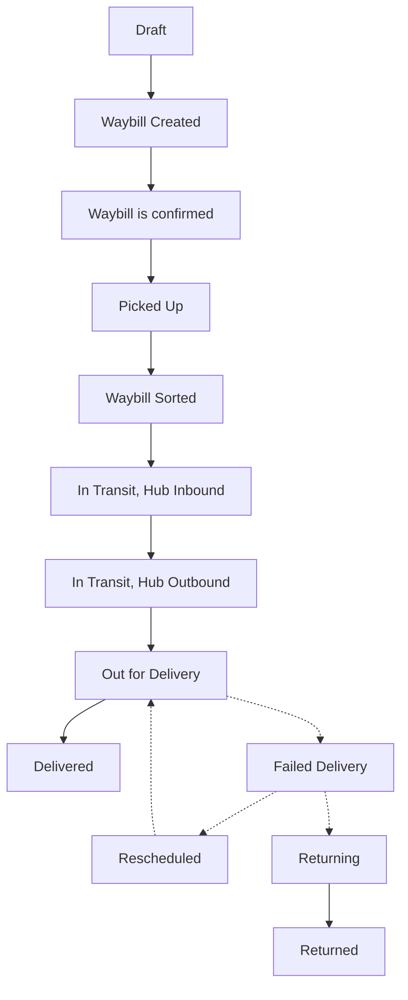

# Waybill status reference

Every step produces a **tracking event**. That chain is what customers see on the public
tracking page, and what you see in the timeline beside a waybill's details.

## The normal path

Goods travelling across regions cycle through hub inbound/outbound several times. That
is normal, not an exception.

## Every status

| Status | When it appears |
|---|---|
| Draft | The waybill is still being put together |
| Waybill Created | Created but not yet confirmed. **Labels won't print in this status** |
| Waybill is confirmed | Accepted by the carrier |
| Picked Up | Collected |
| Waybill Sorted | Sorted at a hub |
| In Transit, Hub Inbound | Arrived at a hub |
| In Transit, Hub Outbound | Departed a hub |
| In Transit | On the move |
| Out for Delivery | With a driver, being delivered |
| Delivered | Arrived |
| Failed Delivery | This attempt didn't succeed |
| Rescheduled | Another attempt booked |
| Exception | Something needs a human |
| Returning / Returned | On its way back, or back |
| Canceled | Voided |

## Where statuses come from

| Source | See |
|---|---|
| Driver scanning | [Driver scanning](../driver/scan) |
| Manual entry | [Adding tracking events](./events) |
| Connected systems | [Developer Guide](/tms/webhooks) |

## Getting status changes into your own system

Configure an **automation rule** to call your endpoint when a delivery event is created.
Set it up under **Settings → Automation**; the technical detail is in the
[Developer Guide's webhook chapter](/tms/webhooks).
